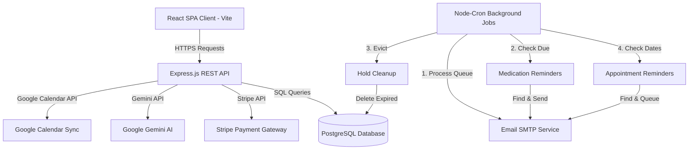
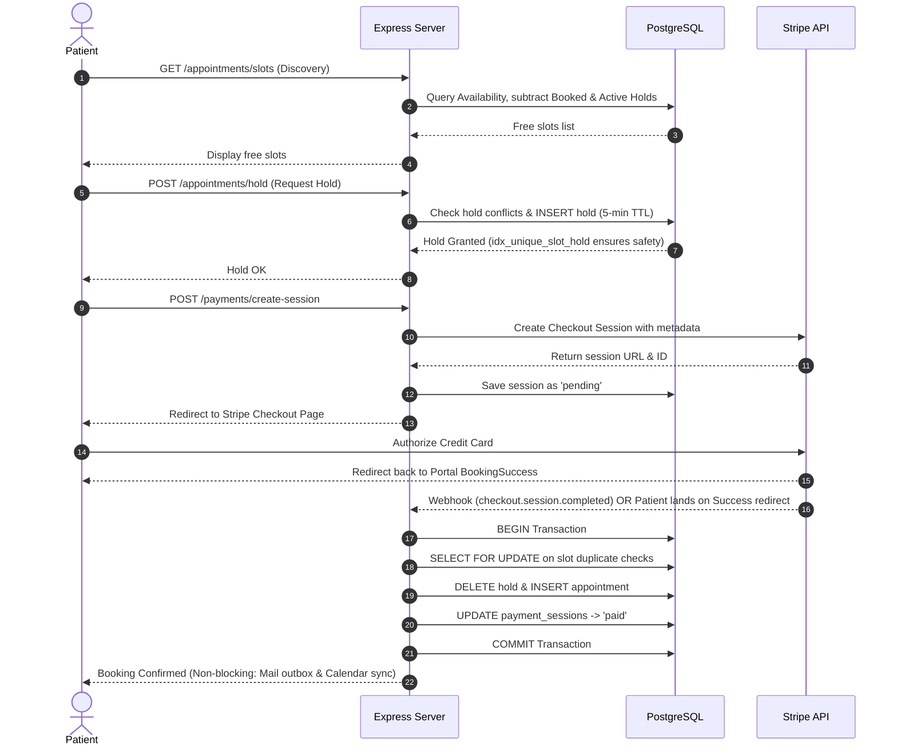

# Detailed Technical Analysis: Healthcare Appointment Manager

This document provides a comprehensive analysis of the Healthcare Appointment Manager, a multi-role, secure, full-stack application built using Node.js/Express, React, and PostgreSQL.

---

## 1. System Architecture Overview

The application follows a **three-tier client-server architecture** reinforced with background processing, dual-user external calendar syncing, asynchronous email processing, Stripe payment checkout, and generative AI features.

---

## 2. Directory Structure & Modular Layout

The repository is divided into two primary workspaces: `client` and `server`.

### Backend Layout (`/server/src/`)
* **`index.js`**: Core entrypoint. Sets up HTTP security headers (`helmet`), cross-origin policies (`cors`), cookie parsing (`cookie-parser`), request throttling (`express-rate-limit`), registers domain routes, and kicks off cron processors.
* **`db/`**: Connection management (`pool`) and database migration routines (`schema.sql`, `setup.js`).
* **`jobs/`**: Background schedules (`cron.js`) for notifications, reminders, and holds.
* **`common/`**: Express middlewares (`auth`, `error`, `upload`, `validate`) and token utilities.
* **`api/`**: Encapsulates functional domains in a standard controller-service pattern:
  * `auth/`: Handles registration, login, token refresh, and credentials validation.
  * `appointments/`: Orchestrates booking slots, hold validation, and schedule adjustments.
  * `doctors/`: Manages doctor info, schedules, and leave days.
  * `patients/`: Patient profile modifications and dashboards.
  * `ai/`: Formulates pre-visit and post-visit summaries.
  * `calendar/`: Connects OAuth channels and populates Google Calendar invites.
  * `prescriptions/`: Logs clinical prescriptions and tracks medication schedules.
  * `payments/`: Starts Stripe Checkout sessions and validates secure webhooks.
  * `pharmacy/`: Handles medicine inventories, marketplaces, and deliveries.
  * `reviews/`: Stores feedback and patient rating metrics.
  * `users/`: General profile listings and data.

### Frontend Layout (`/client/src/`)
* **`App.jsx`**: Controls routing hierarchies. Distinguishes guest routes, public pages, and protected directories.
* **`context/`**: Global react contexts (like `AuthContext.jsx` for login states).
* **`components/`**: Helper components like `ProtectedRoute` (protects dashboard access based on roles).
* **`pages/`**: Sorted by target roles:
  * `/admin/`: Add/Edit Doctors, Manage Leaves, Manage Pharmacies & Inventories.
  * `/doctor/`: View Patient Records, Conduct consultations, Create prescriptions, Summarize notes.
  * `/patient/`: Search doctors, Book appointments, Track pharmacy orders, Review histories.
  * `/pharmacy/`: Dashboard for order processing and dispatching.
  * `/shared/`: WebRTC Telehealth Consultation room using Jitsi.

---

## 3. Core Database Design (PostgreSQL)

The persistence layer relies on relational structures with foreign keys, checks, partial indexes, and custom enum types.

### Key Database Tables

| Table Name | Description | Key Schema Elements & Columns |
| :--- | :--- | :--- |
| **`users`** | Central login repository | `id` (UUID), `email` (Unique), `password_hash`, `role` (enum: `'admin'`, `'doctor'`, `'patient'`) |
| **`patients`** | Profile information for patients | `id` (UUID), `user_id` (FK -> `users`), `first_name`, `last_name`, `date_of_birth` |
| **`doctors`** | Profile information for doctors | `id` (UUID), `user_id` (FK -> `users`), `first_name`, `last_name`, `specialisation`, `slot_duration_minutes` |
| **`doctor_availability`** | Regular recurring doctor schedules | `doctor_id` (FK), `day_of_week` (0-6), `start_time` (Time), `end_time` (Time) |
| **`doctor_leave`** | Dates when doctor is unavailable | `doctor_id` (FK), `leave_date` (Date) |
| **`appointments`** | Confirmed consultations | `id` (UUID), `patient_id` (FK), `doctor_id` (FK), `appointment_date`, `slot_time`, `status` (enum) |
| **`appointment_holds`** | Temporary slot reservations | `id` (UUID), `patient_id` (FK), `doctor_id` (FK), `appointment_date`, `slot_time`, `expires_at` (TTL timestamp) |
| **`payment_sessions`** | Stripe session tracking | `stripe_session_id` (Unique), `patient_id` (FK), `doctor_id` (FK), `amount_cents`, `status`, `appointment_id` (FK) |
| **`ai_summaries`** | Gemini-generated clinical logs | `appointment_id` (FK), `summary_type` (pre/post_visit), `chief_complaint`, `patient_friendly_summary`, `medication_schedule` |
| **`prescriptions`** | Clinical medication records | `id` (UUID), `appointment_id` (FK), `medications` (JSONB list) |
| **`pharmacies`** | Registered drugstores | `id` (Serial), `name`, `email` (Unique), `password_hash`, `phone` |
| **`pharmacy_medicines`** | Inventory of medicines per store | `pharmacy_id` (FK), `medicine_name`, `price_usd` (Numeric), `stock_qty` (Int) |
| **`pharmacy_orders`** | Purchases placed by patients | `id` (Serial), `prescription_id` (FK), `patient_id` (FK), `pharmacy_id` (FK), `delivery_status`, `tracking_updates` (JSONB) |
| **`medication_reminders`** | Medication alerts queue | `id` (UUID), `prescription_id` (FK), `scheduled_for`, `status` (pending/sent/failed) |
| **`email_queue`** | Outbox for asynchronous mail delivery | `id` (UUID), `to_email`, `subject`, `body`, `status` (pending/sent/failed/dead), `attempts` |

---

## 4. Key Workflows & Mechanisms

### 4.1 The Two-Phase Booking and Payment Flow
To prevent race conditions where multiple patients attempt to pay for the exact same slot at the same time, the system uses a **hold-then-pay-then-confirm** pattern:

1. **Unique Indexes**: At the database level, `idx_unique_slot_hold` on `appointment_holds(doctor_id, appointment_date, slot_time)` stops concurrent transactions from creating multiple holds for the same slot.
2. **Double-Booking Prevention**: When payment finishes, a transaction is opened. It runs a `SELECT ... FOR UPDATE` on `appointments` to guarantee no other confirmation went through, and then checks the index constraint `idx_unique_active_appointment`.

---

### 4.2 AI Service & Clinical Summaries
Clinical summaries are processed automatically at two different stages of the patient journey:

1. **Pre-Visit Symptoms Check**:
   * Triggered when patients submit symptoms upon checkout.
   * Prompts Gemini (`gemini-2.5-flash`) to parse symptoms and return structured JSON containing:
     * `urgency`: Emergency categorization (`Low`, `Medium`, or `High`).
     * `chief_complaint`: Concise summary of symptoms.
     * `suggested_questions_for_doctor`: List of clarifying clinical questions for the doctor to review.

2. **Post-Visit Instructions**:
   * Formulated when doctors submit consultation clinical notes.
   * Prompts Gemini to translate clinical notes into patient-friendly advice:
     * `patient_friendly_summary`: Plain-English explanation.
     * `medication_instructions`: Easy-to-understand medication intervals.
     * `follow_up_advice`: Direct instructions for potential next steps.
   * Automatically moves appointment status to `'completed'`.

#### Resilience & Resilient Fallback Strategy
To prevent service disruptions if Gemini API limits are hit or the internet connection drops, the `AIService` implements a layered fallback pattern:
* **Exponential Backoff**: Tries primary model API calls up to 3 times with growing wait times (`Math.pow(2, i) * 1000` ms).
* **Local Parsing Engine**: If Gemini is unreachable or returns malformed data, the backend falls back to a deterministic regex parser. High/Medium urgency are classified based on key clinical terms (e.g., *chest pain*, *breathing*, *bleeding*), and standard guidelines are populated automatically. Patient profiles and clinical records remain perfectly saved in the database without raising HTTP 500 errors.

---

### 4.3 Google Calendar Dual-User Sync
When an appointment is verified, rescheduled, or cancelled, the backend synchronizes the change to external calendars:
* **OAuth 2.0 Token Store**: Refresh tokens are collected and stored securely in `user_oauth_tokens`.
* **Dual Event Invives**: The server fetches credentials for **both** patient and doctor. It sets up calendar sync mappings in `calendar_sync`, updating or removing events synchronously for both users.
* **Graceful Degradation**: If one or both parties have not authorized Google Calendar access, the server skips the integration silently and continues without throwing exceptions.

---

### 4.4 Asynchronous Email Queueing
Instead of sending emails synchronously during booking requests (which delays API responses and fails completely if the SMTP server is down), the project uses a persistent email outbox pattern:
* **Outbox Logging**: Action handlers call `enqueueEmail(to, subject, body)`, which writes the entry to the `email_queue` table with status `'pending'`.
* **Cron Executor**: Every minute, a background cron job fetches up to 50 pending or failed emails.
* **Dead Letter Protection**: Emails that fail SMTP delivery are retried up to 3 times. If they fail all attempts, their status is set to `'dead'` to prevent infinite loops, and the errors are logged in `error_log` for debugging.

---

### 4.5 Medication Reminders
* When a doctor creates a prescription, the medications array is saved.
* Scheduled medication alarms are stored in `medication_reminders`.
* A cron job runs every 10 minutes, selecting pending reminders due for dispatch.
* Concurrency guard: Uses `SELECT ... FOR UPDATE SKIP LOCKED` on database queries. If multiple instances of the server run in parallel (or clustered processes), they won't pick up the same row, avoiding duplicate medication emails to patients.

---

### 4.6 Pharmacy Portal & Marketplace
* **Marketplace comparisons**: Patients can browse all available items. Clicking on a medicine aggregates inventory across pharmacies and lists stores sorted cheapest-first.
* **Prescription Integration**: Patients can buy prescribed medicines directly through the portal, dispatching orders to the respective pharmacies.
* **Fulfillment Pipeline**: The pharmacy logs in with their credentials, reviews pending prescriptions/orders, adjusts stocks, and moves delivery status through:
  `pending` $\rightarrow$ `confirmed` $\rightarrow$ `dispatched` $\rightarrow$ `out_for_delivery` $\rightarrow$ `delivered`.
* **JSONB Logging**: Every transition appends a detailed JSON event node containing timestamps and custom messages into the `tracking_updates` JSONB database column, which is displayed dynamically to the patient as a tracking timeline.

---

### 4.7 WebRTC Telehealth Consultations
* Consultations happen in a dedicated room powered by the **Jitsi Meet API**.
* **Access Control**: Before initializing, the API verifies if the current user is either the doctor or the patient assigned to the `appointmentId`. It blocks external users and prevents entry prior to the scheduled time slot.
* **Post-Call Ratings**: When a patient leaves the video call, they are redirected to a consultation review prompt. Ratings (1-5 stars) and comments are saved in `doctor_reviews`, linking directly to the appointment.

---

## 5. Security Summary
* **Helmet.js**: Imposes safe headers to prevent clickjacking and script injection attacks.
* **CORS**: Origin restriction enforced; only allows calls coming from the `FRONTEND_URL` config.
* **Cookies**: Auth refresh tokens are sent in `HttpOnly`, `Secure` cookies, safeguarding them against Cross-Site Scripting (XSS).
* **Rate Limiting**: Limits API calls to 100 requests per 15 minutes per IP address.
* **Zod Schemas**: Every incoming API body is validated using Zod parser middlewares before it reaches controllers.
